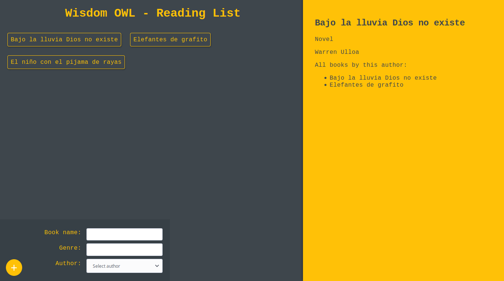
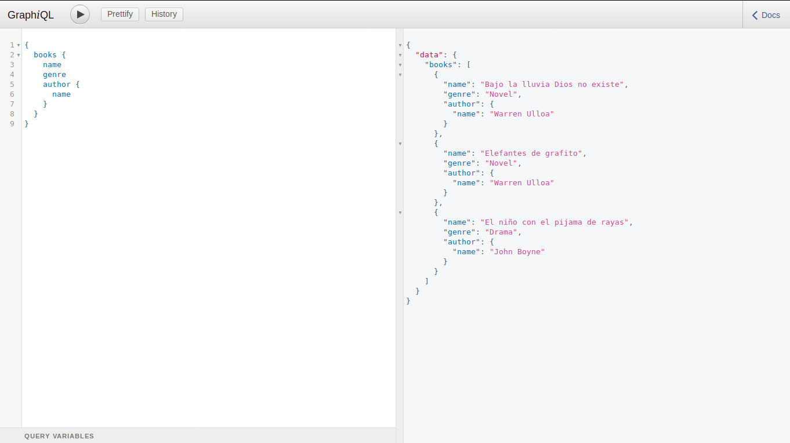

## Wisdom OWL - Reading List
A reading list

#### Client



#### Server



### Steps

##### Server

Step 1: Clone or download the repo.

Step 2: Switch to your repository's directory
```
cd /path/to/your/repo
```

Step 3: Switch to your server directory
```
cd server
```

Step 4: Install dependencies
```
npm install
```

Step 5:  Duplicate the .env-example file and rename it to .env and change the environment variables
```
cp .env-example .env
```

Step 6: Run the server
```
npm start
```

##### Client

Step 7: Open a new terminal in your repository's directory
```
cd /path/to/your/repo
```

Step 8: Switch to your client directory
```
cd client
```

Step 9: Install dependencies
```
npm install
```

Step 10: Change the Apollo Client's uri located inside the `client/src/index.js` file by the path/url of your server

Step 11: Run the server

Step 12: Run the client
```
npm start
```

Made with &#10084; by bryandms